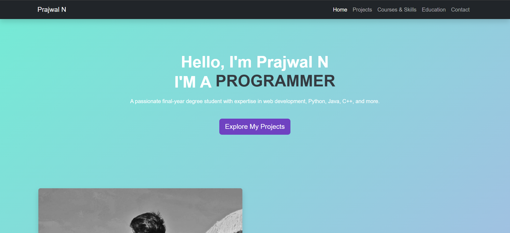

<h1 align="center">🌐 Prajwal N — Portfolio Website</h1>

<p align="center">
  <a href="https://prajwal-portfolio-yet4.onrender.com" target="_blank">
    🔗 <strong>Live Demo</strong>
  </a>
</p>

---

## 📌 Overview

This is my personal **portfolio website** built to showcase who I am, what I’ve created, and how you can connect with me. It is simple, elegant, and fully responsive — made using **HTML**, **CSS**, **JavaScript**, and **Bootstrap 5**.

---

## 🚀 Website Features

- 💡 **Animated Hero Section** with professional intro
- 👨‍💻 **About Me** section with image and short biography
- 💼 **Projects** gallery with GitHub repository links
- 🛠️ **Skills & Tools** categorized by technology stack
- 🎓 **Education** timeline with CGPA and achievements
- 📜 **Certificates** display with preview links
- 📬 **Contact Form** via Web3Forms + social links
- 📱 Fully **Responsive Design** for all devices

---

## 📁 Folder Structure

```

Portfolio\_Web/
├── index.html         # Home/About Me
├── projects.html      # Project highlights
├── skills.html        # Programming, Tools, Certificates
├── education.html     # Academic info
├── contact.html       # Contact form + social media
├── img/               # Static images (profile, project, certificate)

```

---

## 🛠️ Tech Stack

| Frontend   | Tools         | Backend/API |
|------------|---------------|-------------|
| HTML5      | Bootstrap 5   | Web3Forms   |
| CSS3       | FontAwesome   | —           |
| JavaScript | GitHub Pages  | —           |

---

## 📷 Preview




---

## 🙋‍♂️ About Me

**Prajwal N**  
🎓 Final year BCA student at **National Degree College, Bagepalli**  
💡 Enthusiastic about programming, UI/UX, and software development  
🚀 Exploring full-stack web apps, Python tools, and AI assistants  

---

## 📫 Contact Me

- 📧 Email: [prajwalrajn9@gmail.com](mailto:prajwalrajn9@gmail.com)
- 🐙 GitHub: [@PrajwalN9741](https://github.com/PrajwalN9741)
- 🔗 LinkedIn: [Prajwal N](https://www.linkedin.com/in/prajwal-n9741)
- 📸 Instagram: [@_._ite_me_prajju.__](https://www.instagram.com/_._ite_me_prajju.__)

---

## 📄 License

This portfolio is open-source and available for personal learning and inspiration.

> 💙 Built with Bootstrap, passion, and code by **Prajwal N**
